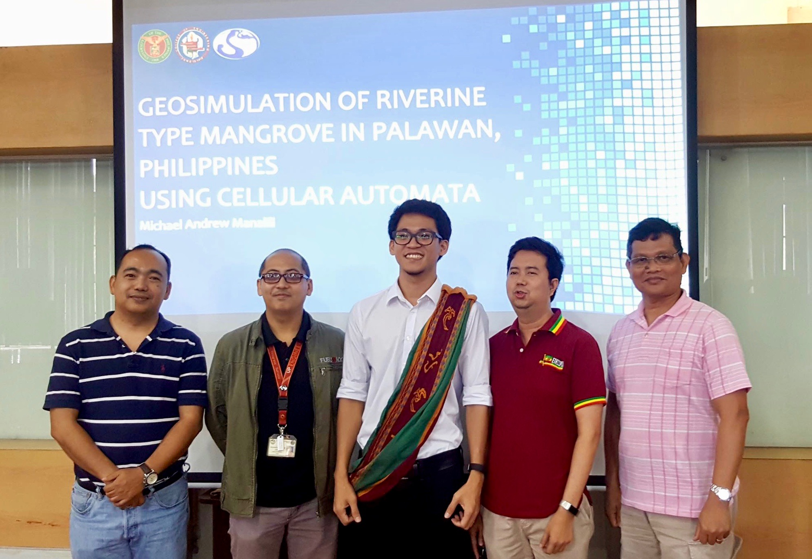
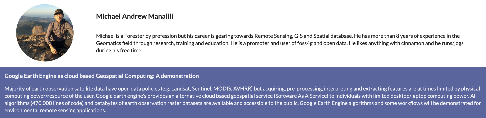
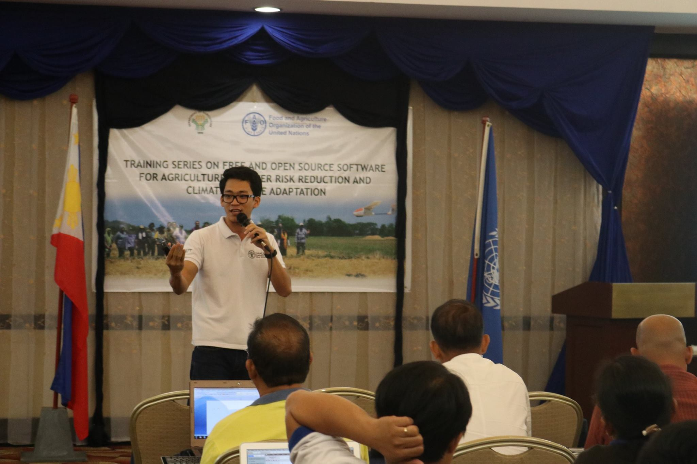
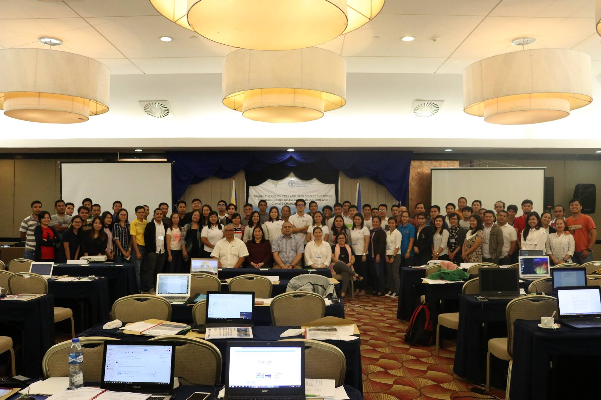
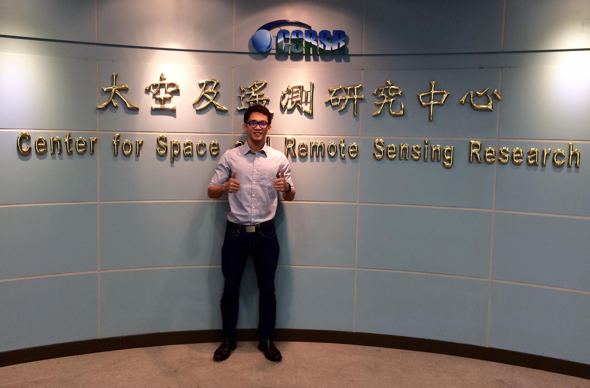
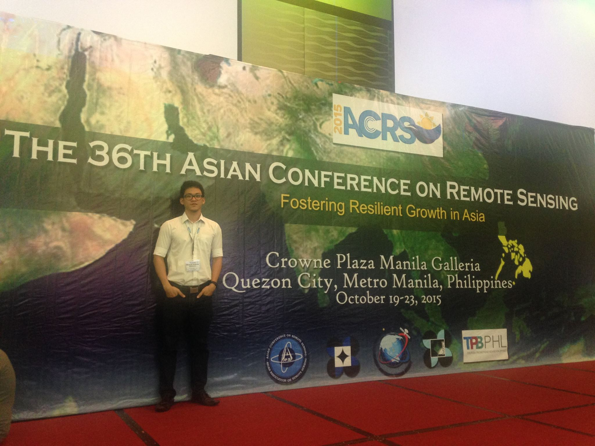
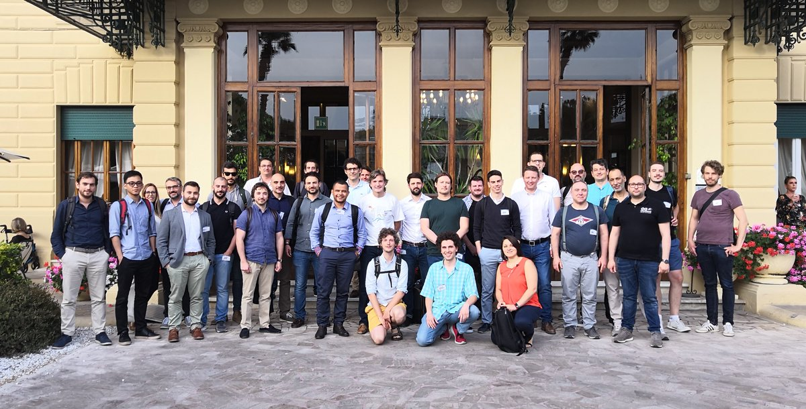
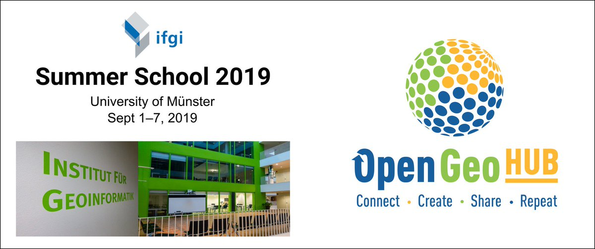
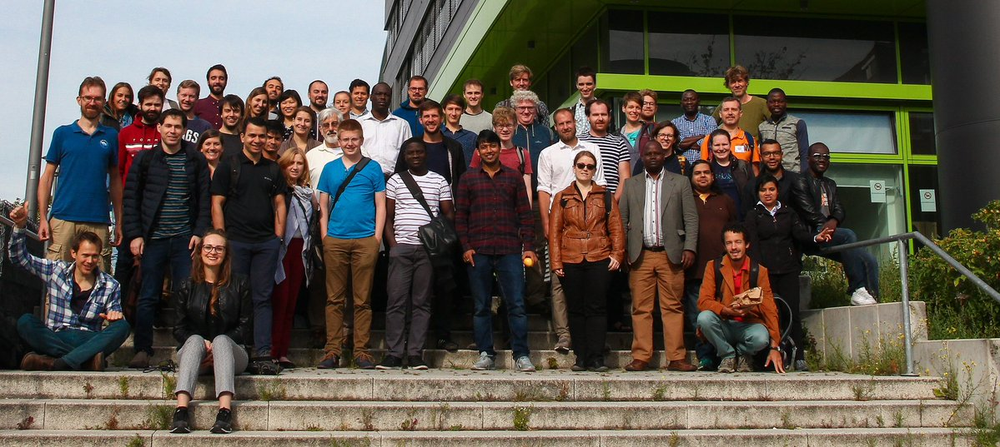
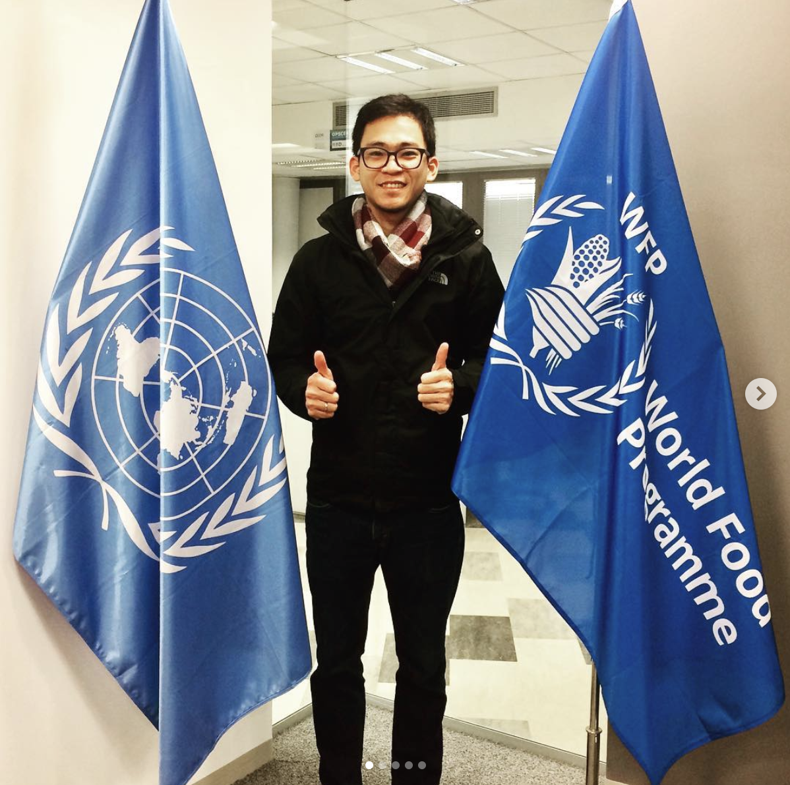

If you want to know more about me, scroll down and follow my geospatial journey!

I am particularly interested in Earth Observation, Satellite Remote Sensing, Space Technology, Computer Vision and 
python programming for scientific and humanitarian applications. I promote the use of Free and Open Source Sofware 
for Geospatial (FOSS4G) and I strongly support open geospatial data.

I am a husband, a father, geospatialist ,and a humanitarian. 

------

## Summary of work experiences

### World Food Programme
#### GIS Developer

Present  Rome, Italy

### Food and Agriculture Organization
#### Geomatics Consultant

Apr 2017 - Nov 2017   Quezon City, Philippines

### Training Center for Applied Geodesy and Photogrammetry
#### Senior Research Associate

July 2015 - March 2017   Quezon City, Philippines

### ADB
#### Database Consultant

Sept 2017 - Nov 2017   Quezon City, Philippines

### GHD
#### GIS Consultant

Feb 2014 - June 2015   Makati City, Philippines

### OceanaGold Corporation
#### Environment Supervisor

Sep 2013 - Jan 2014   Didipio, Nueva Vizcaya, Philippines

### AECOM
#### GIS Consultant

Apr 2011 - Aug 2013   Taguig City, Philippines

### Department of Environment and Natural Resources
#### Research Assistant

May 2009 - Aug 2011   Los Banos, Laguna, Philippines

------

## Education
#### MSc Geomatics Engineering (Geoinformatics)

Oct 2015 - Dec 2018   University of the Philippines, Diliman   Department of Geodetic Engineering, College of Engineering 

Below is a picture of me with my panel members and adviser after my master's thesis defense in 2018 :) 

#### BS Forestry

June 2005 - April 2009   University of the Philippines, Los Baños   College of Forestry and Natural Resources

------

## Volunteer Experience

My volunteer experience is mostly through contribution of geospatial data and information to the humanitarian community related to natural disaters

#### Humanitarian Open Street Map (Data contributor)
#### Humanitarian UAV Network
#### [Humanitarian Data Exchange (Data contributor)](https://data.humdata.org/user/mgmanalili)

------

## FAO Philippines

A short <a href="https://www.youtube.com/watch?v=tBtCVX-j_ek&feature=youtu.be">clip</a> showing how FAO in the Philippines have used drones for DRR.  I am proud to be part of this great effort by the Department of Agriculture and FAOPH.

------

## Talks

I gave a small <a href="https://foss4gph.github.io//">talk</a> on Big Data for Earth Observation and Remote Sensing on Google Earth Engine at the FOSS4G PH event

## Trainings and Conference

I led a training series for the Department of Agriculture Head and Regional offices on the use of Free and Open Source Software for Agriculture DRR (FOSS4AgriDRR) for the Disaster Risk Reduction. Specialized topics on Remote Sensing, GIS Analysis, Geospatial Database, UAV Operation, and Vulanerability Assessment and Mapping were coverd during the the 5 weeks intense training.

------

In 2016, I was one of the lucky grad student to participate in the Capacity Building for South East Asian Scientist program
held at the Center at the Space and Remote Sensing Research (CSRSR) in Taoyuan, Taiwan

------

I had the opportunity to participate in the 36th Asian Conference on Remote Sensing (ACRS) hosted by the Philippines in 2015

------

I participated in the GeoNode Summit 2019 in Viarregio, Italy together with WFP Colleagues. It was a 3 day event where the first day was full of presentation of GeoNode use cases, updates and future developments and the other 2 days are code sprint.

------

I did a 5 full days of training in Muster, Germany for the OpenGeoHub 2019 Summer School. The theme was "Spatial and spatiotemporal computing: processing large-scale Earth observation data" and I learned a lot about parallel computing and other geospatial techniques using R.

------
## Papers

<a href="https://www.researchgate.net/profile/Michael_Andrew_Manalili">Here</a> you can find some of my research works during my stay at the university and our <a href="https://doi.org/10.5194/isprs-archives-XLII-4-W12-83-2019">publication</a> in one of our projects.

------

### Let's connect! :)

