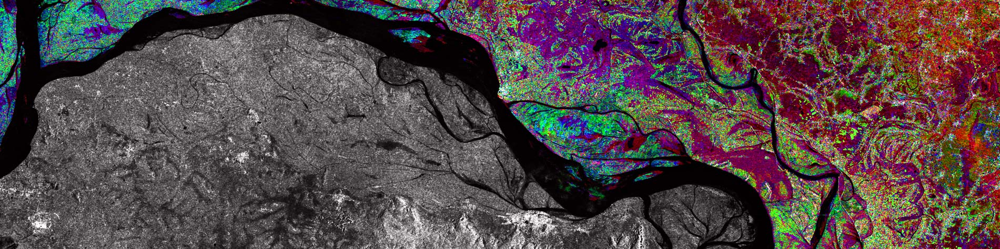

If you want to know more about me and what I do and my iterest, please scroll down ;) 

I am interested in Earth Observation, Remote Sensing, Computer Vision and 
Python programming. I read a lot about Space Technology and I am an
advocate of Free and Open Source Applications for Geospatial (FOSS4G)

I am a husband, a father, and a humanitarian. 

## Summary of work experience

### World Food Programme
#### GIS Developer

Present  Rome, Italy

### Food and Agriculture Oorganization
#### Geomatics Consultant

Apr 2017 - Nov 2017   Quezon City, Philippines

### Training Center for Applied Geodesy and Photogrammetry
#### Senior Research Associate

July 2015 - March 2017   Quezon City, Philippines

### ADB
#### Database Consultant

Sept 2017 - Nov 2017   Quezon City, Philippines

### GHD
#### GIS Consultant

Feb 2014 - June 2015   Makati City, Philippines

### OceanaGold Corporation
#### Environment Supervisor

Sep 2013 - Jan 2014   Didipio, Nueva Vizcaya, Philippines

### AECOM
#### GIS Consultant

Apr 2011 - Aug 2013   Taguig City, Philippines

### Department of Environment and Natural Resources
#### Research Assistant

May 2009 - Aug 2011   Los Banos, Laguna, Philippines

## Education
#### MSc Geomatics Engineering (Geoinformatics)

Oct 2015 - Dec 2018   University of the Philippines, Diliman   Department of Geodetic Engineering, College of Engineering <strong>Master's Thesis</strong> <em>Geosimulation of Riverine Type Mangrove in Palawan, Philippines using Cellular Automata</em>

#### BS Forestry

June 2005 - April 2009   University of the Philippines, Los Banos   College of Forestry and Natural Resources

## Volunteer Experience
#### Humanitarian Open Street Map
#### Humanitarian UAV Network
